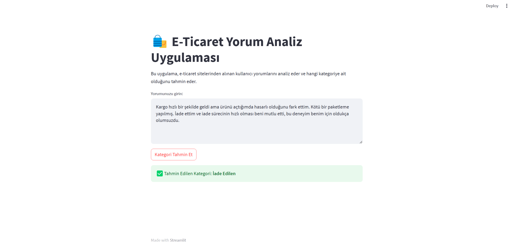

# 🛍️ **BERT E-Commerce Comment Classifier**

**BERT E-Commerce Comment Classifier** is a machine learning project designed to classify user reviews from e-commerce platforms into predefined categories using a **BERT-based model**. This app provides an intuitive and user-friendly interface for classifying comments based on their sentiment and content. It aims to help e-commerce businesses analyze customer feedback quickly and efficiently.

The system uses advanced natural language processing (NLP) techniques to categorize reviews into specific groups that can help identify patterns, customer concerns, and preferences.

---
## 📷 Interface Preview
### Comment-1
  

### Comment-2
  


## 🚀 **Features**

- **Real-Time Classification**: Classifies user reviews into 5 predefined categories instantly as you submit them.
  
- **Categories**: The app classifies reviews into the following categories:
  - 💰 **Price Performance**: Reviews discussing the value for money of a product.
  - 🔄 **Returned Product**: Reviews related to the return process or product dissatisfaction.
  - 📉 **Poor Quality, Defective, Bad Packaging**: Reviews highlighting issues with product quality, defects, or packaging.
  - 📦 **Good Packaging, Fast Delivery**: Reviews focusing on product packaging and delivery speed.
  - ⭐ **Recommended, High-Quality Products**: Positive reviews recommending the product based on quality and experience.

- **BERT-based Model**: The app uses a **BERT-based Turkish Transformers** model for accurate text classification of Turkish e-commerce reviews.

- **Streamlit Interface**: A simple, interactive, and visually appealing interface that allows users to input reviews, get predictions, and view the classification results.

- **Multiple Models Tested**: Various machine learning models like **Logistic Regression**, **Random Forest**, **LSTM**, **CNN**, **GRU**, **BiLSTM**, and **RNN** were trained and compared to find the most effective model for this task.

- **Multi-Class Classification**: The model is capable of handling multi-class classification, allowing for more nuanced insights into customer feedback.

---

## 🤖 **Models Used**

This project utilizes the following models for text classification:

- **BERT-based Turkish Transformers**: A pre-trained transformer model based on BERT, fine-tuned for classifying Turkish reviews.
- **Other Models**:
  - **Logistic Regression**: A linear model used for classification based on a weighted sum of input features.
  - **Random Forest**: A versatile ensemble learning method used to classify reviews based on decision trees.
  - **LSTM (Long Short-Term Memory)**: A deep learning model specialized in processing sequences like text.
  - **CNN (Convolutional Neural Network)**: Often used for image processing, CNNs can also classify text based on local features.
  - **GRU (Gated Recurrent Units)**: A variant of RNNs that is faster and more efficient in training.
  - **BiLSTM (Bidirectional LSTM)**: LSTM extended to learn from both the past and future context of the sequence.
  - **RNN (Recurrent Neural Networks)**: Used for sequence prediction, RNNs process data in a step-by-step manner.

The **BERT** model provides the best results for text classification, but the project includes other models to compare and understand performance trade-offs.

---

## 🧑‍💻 **How It Works**

The app works by preprocessing and cleaning the input text, then using a trained machine learning model to predict the category of the review. The steps involved include:

1. **Text Preprocessing**: 
   - The input text is cleaned by removing stopwords, punctuation, and numbers.
   - Text is tokenized, lemmatized, and transformed into a sequence of tokens suitable for model input.

2. **Model Prediction**:
   - The cleaned text is passed through the pre-trained **BERT model** (based on **Transformers**) or any other selected model to predict the category.

3. **Result**:
   - The app displays the predicted category of the review (e.g., "Recommended, High-Quality Products").

---

## 🛠️ **Installation**

To get started with this project, follow the steps below to set up the environment and run the application locally.

### 1. **Clone the repository**
First, clone the repository to your local machine:
```bash
git clone https://github.com/HasanCan6241/bert-ecommerce-comment-classifier.git
cd bert-ecommerce-comment-classifier
